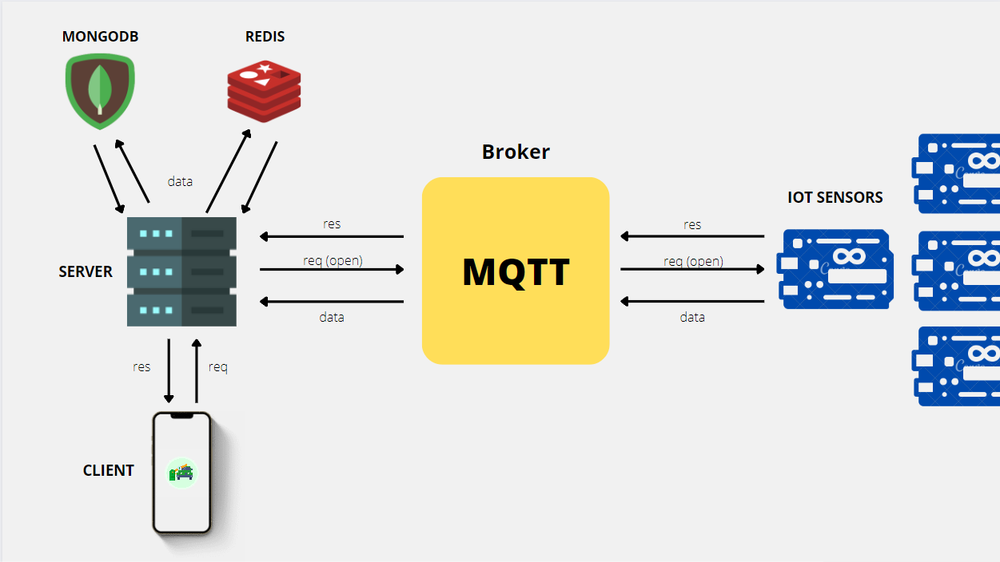

# ACP Backend

The backend part of the ACP project which is an app for reserving parking spaces is built using Node JS as a backend language, Redis and MongoDB as databases for storing data and a broker deployed on the cloud.

The broker is an intermediary between the server and the IOT sensors. Server subscribed to the topic responsible for receiving the sensor status of parking spaces and consumes the upcoming data from this topic. Since there may be millions of sensors sending their status every second and the data is frequently changing, the server then transmits the current parking spots immediately to be stored in the Redis database since it is appropriate for this problem and Redis allows intense read and write operations. 

The user utilizes the mobile application to find a nearby parking space and reserve it. The user selects the destination along with the date and time, and the server receives and processes the request to return all available parking spaces within 5 kilometers. The user receives the parking spaces and selects one. Then the server stores the reservation data in MongoDB since it’s a persistent database unlike Redis that has limited capacity and data is stored in the cache temporary. Then the system starts navigating the user to their destination. Once user arrives, they request to open the parking space. This request is sent to the server then the server send it to the Broker through the MQTT protocol with a specific topic that is only linked to the parking space that user reserved. Broker then forward the message to the corresponding parking space with this id. Once the request received by the ESP8266 that subscribed to the topic, it opens the barrier and user park the car. When user finishes, they pay the fees. When it is confirmed, the barrier opens, and the car can leave.

### Architecture of the system

 
